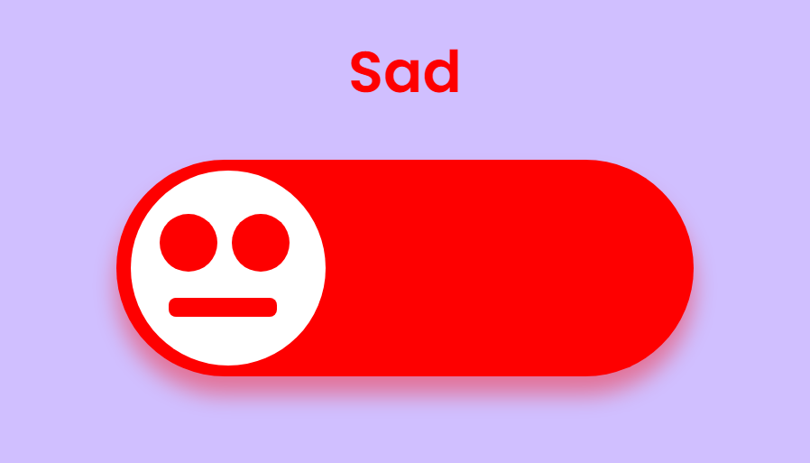

# An Animated Simple Emoji Button :sparkles:
A simple animated emoji button using pure css and javascript.

## Preview:

## Technologies used: :sparkles:
- HTML
- CSS
- Javascript

## Features: 
- Animated Emoji 🎗️
- Happy mode 🔵
- Sad mode 🔴

### Sources:
This Banner is created with the help of youtube video of Online Tutorials. Thanks to [Online Tutorials](https://www.youtube.com/c/OnlineTutorials4Designers).
### Live website:
Watch the live website [here](https://ashwinkl.github.io/Simple-Emoji-Button/)
